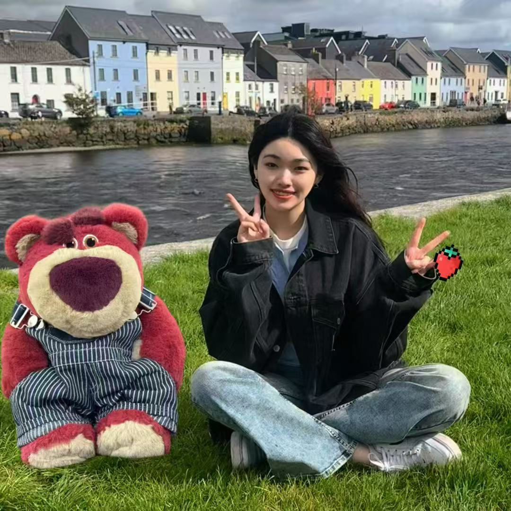
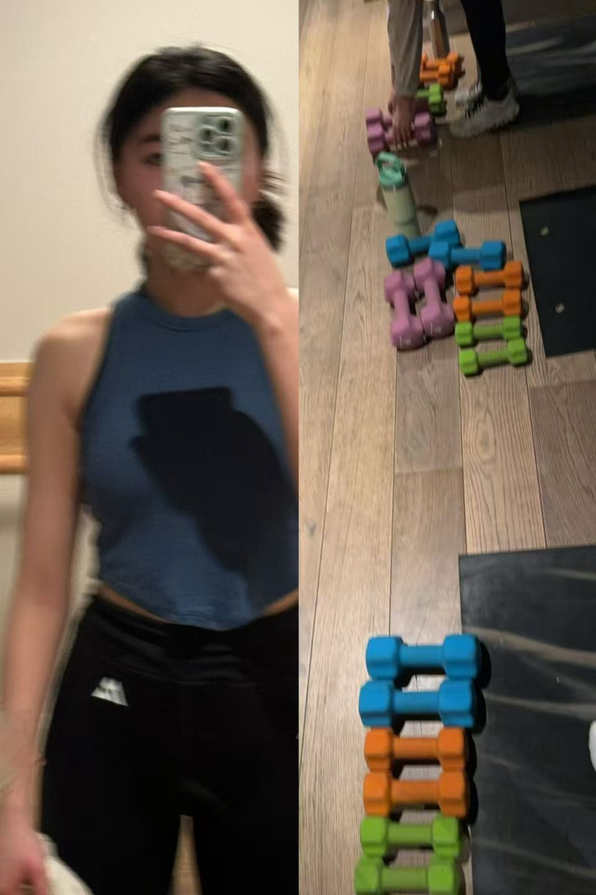
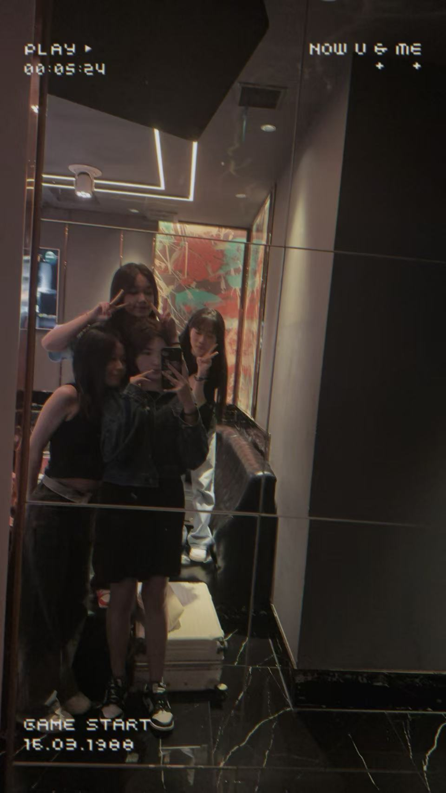

# About Me

{.about-inline-photo}

A final-year Business Studies student with a growing passion for business analysis, marketing planning, and process improvement.

I am currently studying Business Studies at Dublin City University and building practical experience through academic projects, internship exposure, and ACCA learning. I enjoy structured thinking, solving real business problems, and connecting analysis with meaningful decisions.

My interests lie in business insight, operational efficiency, customer-focused strategy, and graduate opportunities where I can continue to grow both professionally and personally.

## My Journey

### 🎓 Academic Development
Studying Business Studies at Dublin City University, with particular interest in business analytics, marketing strategy, and organisational improvement.

### 💼 Practical Experience
Gaining real-world exposure through accounting internship experience, including finance support, documentation, and operational understanding.

### 📘 Professional Growth
Strengthening my accounting and finance knowledge through ACCA studies while building a clearer direction toward business-focused graduate roles.

## Core Skills

| Skill Area | Focus |
|---|---|
| 📊 Business Analysis | Structured analysis, insight, and decision support |
| 📈 Marketing Planning | Customer-focused thinking and practical strategy |
| 💰 Accounting Support | Finance exposure and operational documentation |
| ⚙️ Process Improvement | Efficiency, workflow, and better business outcomes |
| 🧠 Problem-Solving | Logical thinking and clear approaches to challenges |
| 🌍 Communication | Written, spoken, and interpersonal communication |
| 🤝 Teamwork | Collaboration and adaptability |
| 🌐 Chinese & English | Bilingual communication ability |

## Global Footprint

### Lived / Studied
::: {.flag-row}
🇨🇳
🇮🇪
:::

### Explored / Recorded
::: {.flag-row}
🇬🇧
🇮🇹
🇪🇸
🇪🇪
🇫🇮
🇨🇳
🇮🇪
:::

## Behind the CV

A more personal side of my journey — the places I live in, the moments I record, the people I treasure, and the lifestyle that keeps me balanced.

::: {.behind-grid}

::: {.behind-card}
[{.behind-card-img}](dublin-life.html)

### Dublin Life
Study, city walks, and everyday life in Ireland.
:::

::: {.behind-card}
[{.behind-card-img}](scenery.html)

### Record the Scenery
Capturing light, streets, skies, and quiet moments.
:::

::: {.behind-card}
[{.behind-card-img}](travel.html)

### Travel
New cities, new cultures, and new perspectives.
:::

::: {.behind-card}
[{.behind-card-img}](gym.html)

### Gym & Pilates
Discipline, balance, and energy beyond academics.
:::

::: {.behind-card}
[{.behind-card-img}](friends.html)

### Friends
Shared memories, connection, and meaningful moments.
:::

::: {.behind-card}
[{.behind-card-img}](food.html)

### Food
Coffee, cafés, comfort meals, and little moments of joy.
:::

:::


```{=html}
<style>
/* ===== FINAL NAVY + LIGHT BLUE OVERRIDE ===== */
#quarto-header,
#quarto-header .navbar,
.navbar,
.navbar-expand-lg,
.navbar.navbar-expand-lg,
.headroom,
.headroom--pinned,
.headroom--unpinned {
  background: #163458 !important;
  background-color: #163458 !important;
  background-image: none !important;
  box-shadow: 0 10px 24px rgba(17,39,67,0.18) !important;
  border: none !important;
}

#quarto-header *,
.navbar *,
.navbar-brand,
.navbar-brand .menu-text,
.navbar-nav .nav-link,
.navbar-nav .nav-link .menu-text,
.navbar .nav-link,
.navbar .nav-link .menu-text,
.navbar .navbar-title,
.navbar .title,
.menu-text {
  color: #ffffff !important;
}

html, body, main.content, .page-columns, .page-full, .column-page, #quarto-content {
  background: linear-gradient(180deg, #eef3f8, #e7eef6) !important;
  color: #5c6b7a !important;
}

.preview-entry-card,
.home-feature-card,
.home-contact-card,
.connect-form,
.guestbook-shell,
.reflection-hero,
.reflection-card,
.certificate-hero,
.certificate-card,
#home-about .home-about-panel,
#home-about .home-about-text,
#home-about .home-about-image,
.panel,
.card,
.card-body,
.callout,
.callout-note,
.callout-tip,
.callout-important,
div[style*="background:rgba(255,255,255"],
div[style*="background: rgba(255,255,255"],
div[style*="rgba(243,236,255"],
div[style*="rgba(241,236,255"] {
  background: rgba(236,243,250,0.95) !important;
  background-color: rgba(236,243,250,0.95) !important;
  background-image: none !important;
  border-color: rgba(176,191,210,0.38) !important;
  color: #5c6b7a !important;
}

h1, h2, h3, h4, h5, h6,
.title,
.quarto-title,
strong, b {
  color: #24364a !important;
}

p, li, span, label, small {
  color: #5c6b7a !important;
}

button,
.btn,
.btn-primary,
.certificate-btn,
.preview-entry-link,
#home-about .home-pill,
#home-connect .connect-btn,
.enter-home-btn,
a.btn,
a[role="button"] {
  background: linear-gradient(135deg, #163458, #234b78) !important;
  background-color: #163458 !important;
  color: #ffffff !important;
  border: 1px solid rgba(255,255,255,0.16) !important;
  box-shadow: 0 12px 24px rgba(24,52,88,0.16) !important;
}

input, textarea, select {
  background: rgba(255,255,255,0.96) !important;
  border: 1px solid rgba(176,191,210,0.42) !important;
  color: #24364a !important;
}

input::placeholder,
textarea::placeholder {
  color: #7b8794 !important;
}

.home-side-nav a {
  background: rgba(236,243,250,0.96) !important;
  border: 1px solid rgba(176,191,210,0.34) !important;
  color: #163458 !important;
}

.home-side-nav a.is-active {
  background: linear-gradient(135deg, #163458, #234b78) !important;
  color: #ffffff !important;
}

.guestbook-shell .message-card,
.guestbook-shell .guestbook-bubble,
.guestbook-shell .guestbook-message,
.guestbook-shell .chat-bubble,
.guestbook-shell .guest-entry,
.guestbook-shell .message,
.guestbook-shell .note-card {
  background: rgba(245,249,253,0.97) !important;
  border: 1px solid rgba(185,198,214,0.34) !important;
  box-shadow: 0 10px 22px rgba(31,58,91,0.08) !important;
}

[style*="243,236,255"],
[style*="241,236,255"],
[style*="#7d74d9"],
[style*="#9a92eb"],
[style*="rgba(243,236,255"],
[style*="rgba(241,236,255"] {
  background: rgba(236,243,250,0.95) !important;
  color: #24364a !important;
}
</style>
```

