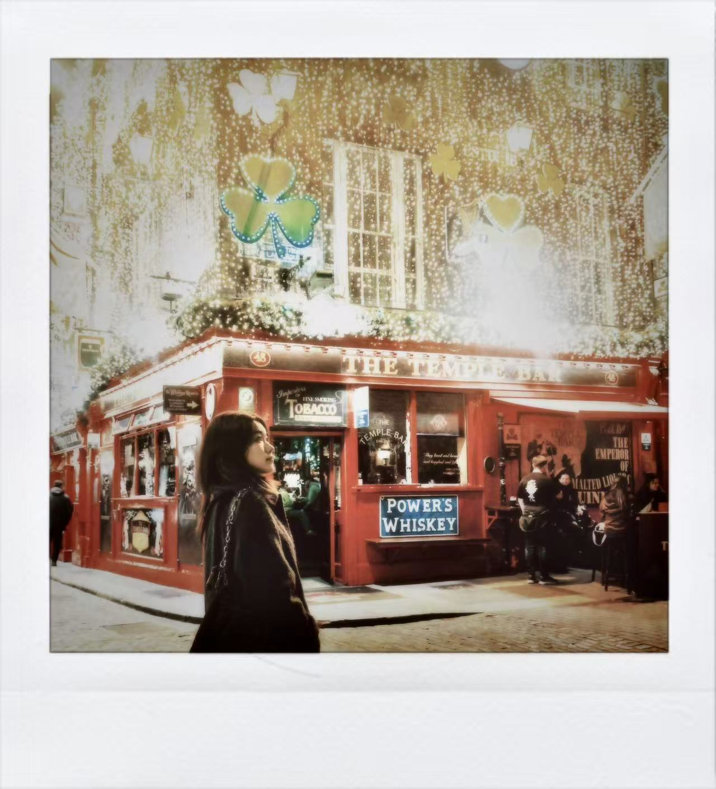
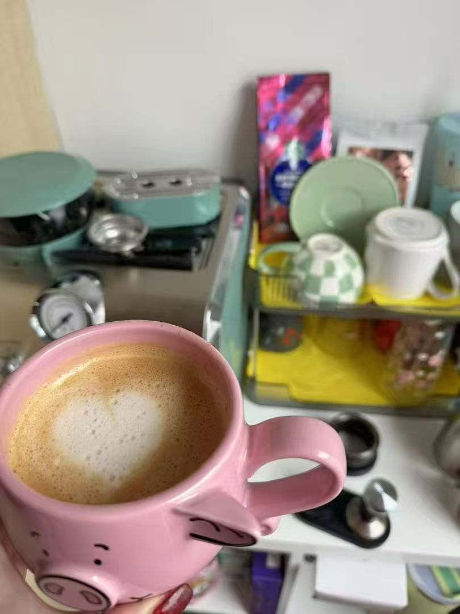
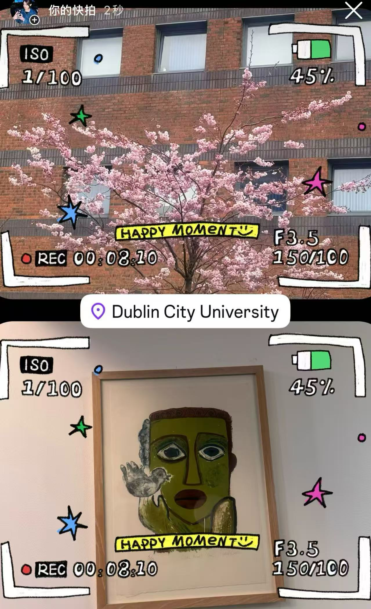
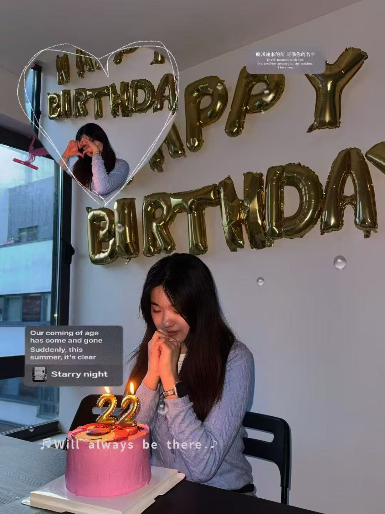

<video class="hero-video-only" autoplay muted loop playsinline>
  <source src="images/dublin-life-6.mp4" type="video/mp4">
</video>

# Dublin Life

A glimpse into my life in Dublin — study, city moments, friendships, and the quiet memories that shape my everyday experience.

  
  
  
  
  
  
  
  
  
  
  
▶ Video 1

  
▶ Video 2

