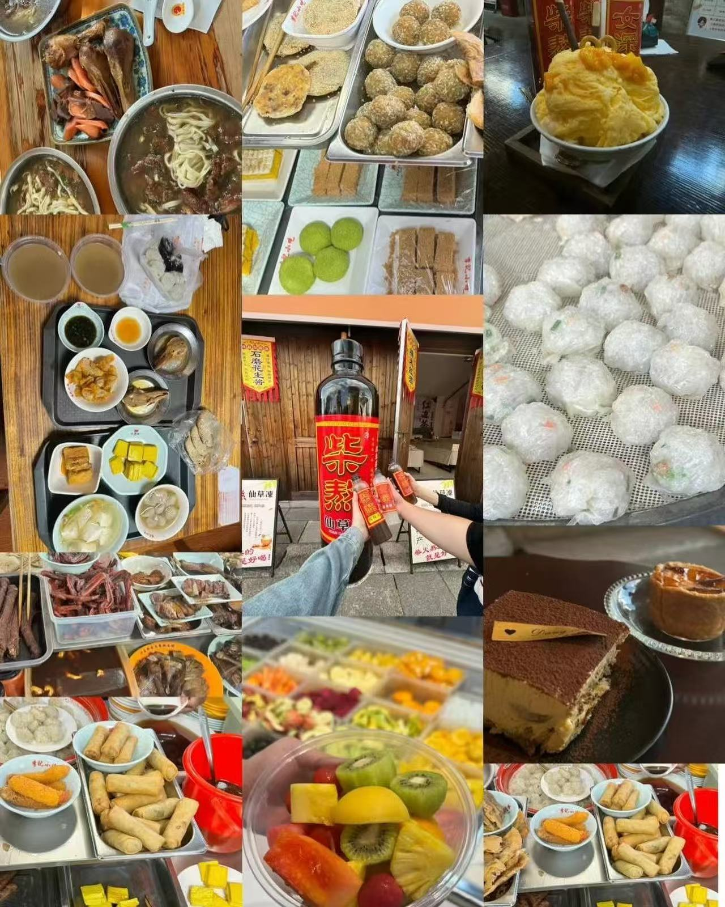
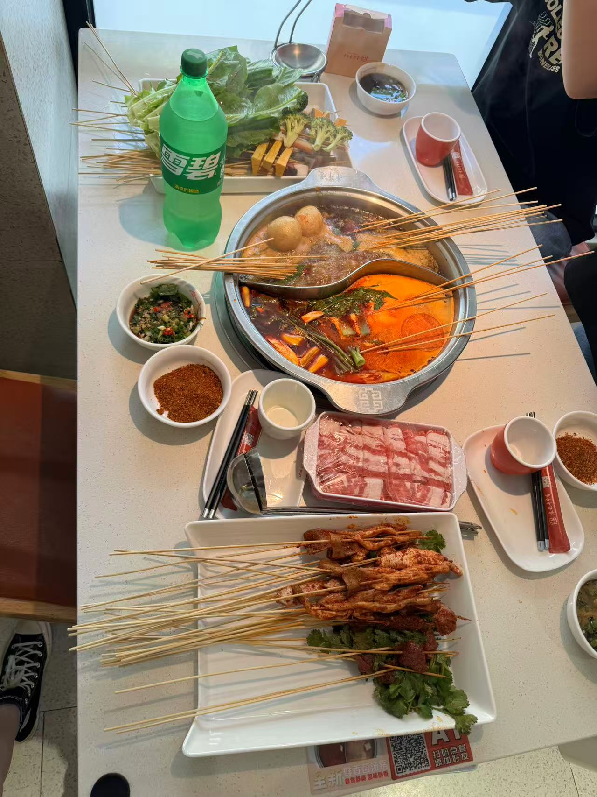
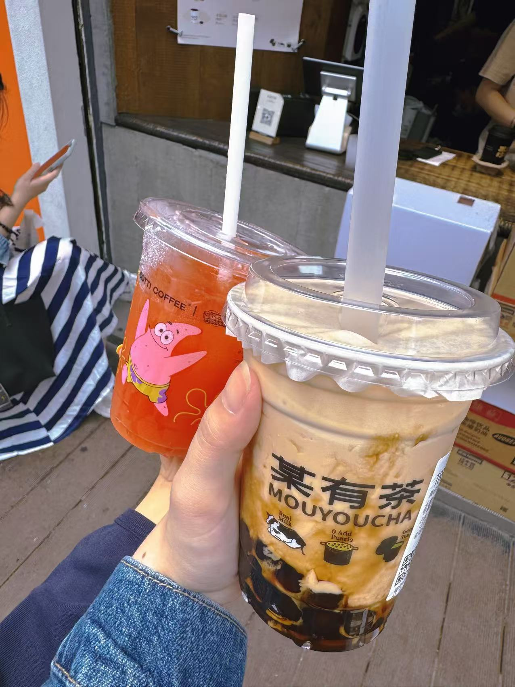
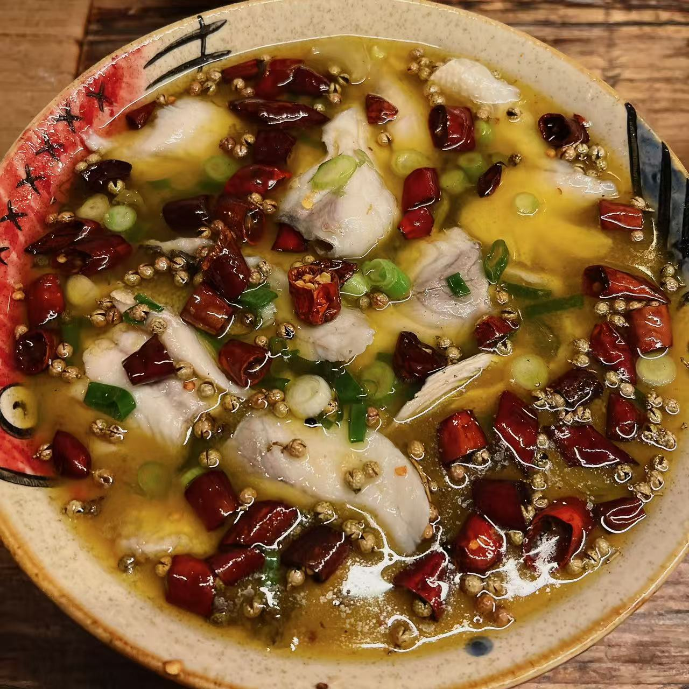
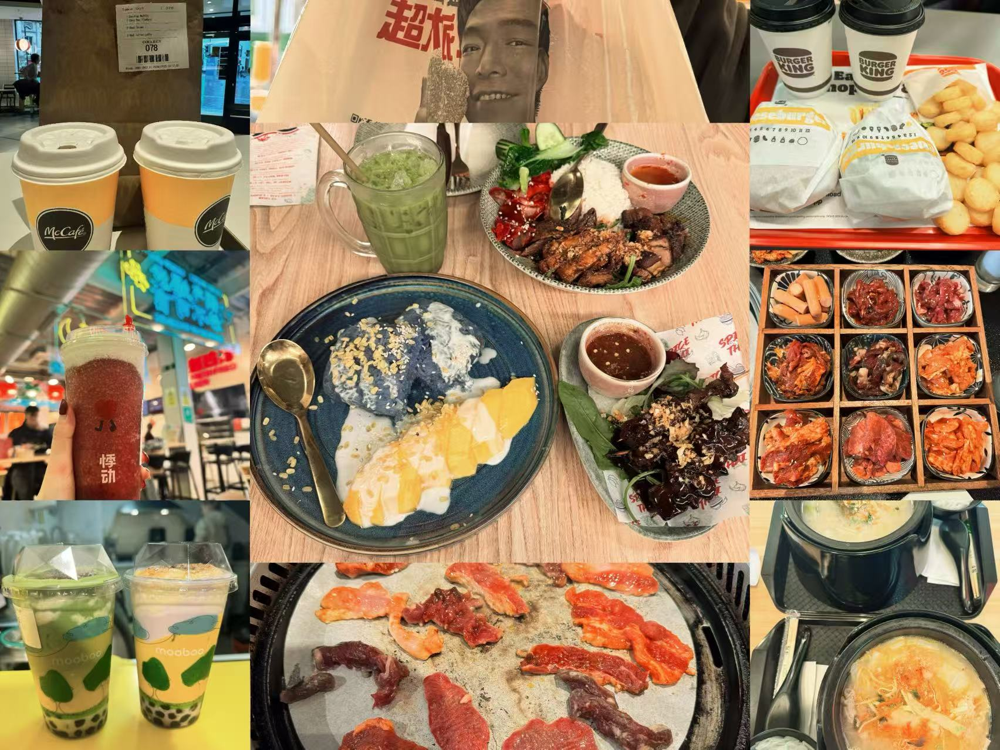

<video class="hero-video-only" autoplay muted loop playsinline>
  <source src="images/food-10.mp4" type="video/mp4">
</video>

# Food

A collection of cafés, comfort meals, desserts, and beautifully presented moments that make everyday life feel warm and memorable.

  
  
  
  
  
  
  
  
  
  
▶ Video

