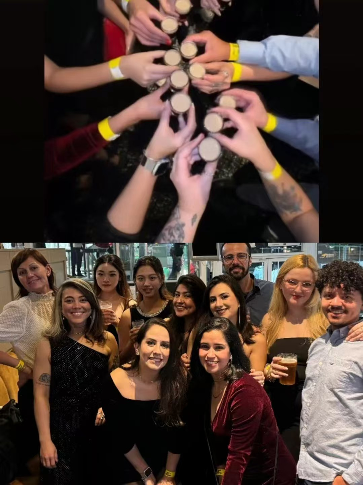
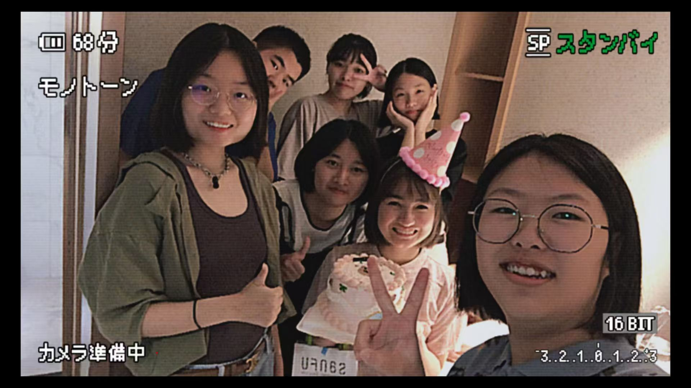

<video class="hero-video-only" autoplay muted loop playsinline>
  <source src="images/friends-8.mp4" type="video/mp4">
</video>

# Friends

The people who make life warmer — shared memories, laughter, support, and the moments that matter most.

  
  
  
  
  
  
  
  
  
  
▶ Video

