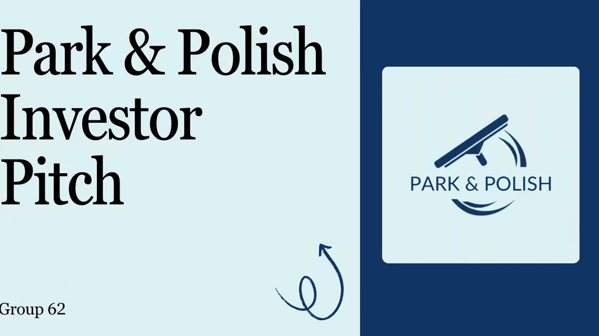
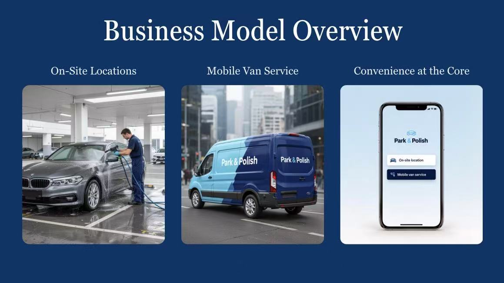
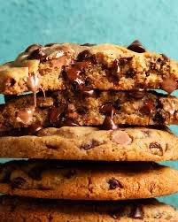

# Projects

This page presents three projects that reflect my interests in business analysis, marketing strategy, supply chain thinking, and process improvement. Together, they show how I approach business problems from both a strategic and operational perspective.

---

## Project 1: Park & Polish  
### Developing a Mobile Car Care Venture Through Market Analysis and Marketing Strategy

{.project-image}

Park & Polish was developed as part of a New Enterprise Development project. The concept focused on turning parked time into productive service time by offering a mobile car wash and detailing service while customers’ vehicles were already parked at locations such as golf clubs, airports, and business parks.

### Business Problem / Opportunity

Traditional car washing is often inconvenient, time-consuming, and poorly aligned with the routines of busy customers. Our research identified that many users delay vehicle cleaning because they do not want to spend extra time driving to a car wash or waiting in queues. Park & Polish addressed this by repositioning car care as a service delivered during existing parking time, especially in environments where cars remain idle for several hours.

### Objective

The objective of this project was to develop a venture concept that combined convenience, sustainability, and digital service design into a differentiated business model. The aim was not simply to create another car wash service, but to design a customer-centred solution with clear growth potential and a premium brand identity.

### My Role

My contribution focused on supporting the development of the business concept and strategic logic behind the service. I worked on understanding customer pain points, clarifying the value proposition, and shaping how convenience, digital experience, and repeat-use mechanisms could support long-term growth. I also contributed to presenting the service as a scalable and customer-focused solution rather than a one-off transaction.

### Methods / Tools

This project drew on several business and marketing tools, including:

- customer pain point analysis
- empathy mapping
- strategy canvas thinking
- value proposition development
- business model and growth planning
- KPI-based marketing evaluation

The project materials also incorporated digital journey design, partnership logic, and retention strategy through memberships, referrals, and service quality systems.

### Business Model Visual

{.project-image}

### Key Insights

Several insights shaped the final concept:

- **Convenience as competitive advantage:** the business turned “lost” parking time into useful service time.
- **Digital experience as differentiation:** booking, payment, notifications, and loyalty features created a more seamless customer journey than traditional car washes.
- **Sustainability as part of the brand:** the concept used water-saving methods and biodegradable products to align with customer expectations and environmental priorities.
- **Scalability through partnerships:** partner venues such as clubs, airports, and parking facilities were central to both customer acquisition and trust-building.
- **Retention and quality systems matter:** memberships, referrals, before/after proof, reviews, and KPI dashboards were used to support repeat business and long-term growth.

### Outcome

The final outcome was a professionally structured venture concept with a clear value proposition, customer segment, service model, and growth strategy. The project showed how a familiar service could be redesigned through customer insight, digital thinking, and strategic positioning to create a more compelling business opportunity.

### Reflection

This project strengthened my understanding of customer-centred business design, value proposition development, and marketing strategy. It also showed me that a strong business idea depends not only on creativity, but on how effectively it solves a real user problem and connects that solution to operations, partnerships, and measurable growth.

---

## Project 2: Business Analysis and Process Improvement Project  
### Operational Cost Analysis and Profitability Improvement in a Cookie Manufacturing Business

{.project-image}

This project focused on the analysis of a cookie manufacturing company, with the aim of improving both production and sales performance through better cost understanding and process evaluation.

### Business Problem / Opportunity

Manufacturing businesses often face pressure to manage rising input costs, maintain margins, and improve efficiency across multiple stages of production and delivery. In this project, the key challenge was to understand where costs were being generated, how they affected profit margins, and where operational improvements could create better financial outcomes.

### Objective

The objective was to evaluate the company’s production and sales processes, identify inefficiencies, and generate practical recommendations to improve profitability. This included a focus on production costs, margin performance, and cost-saving opportunities across the supply chain.

### My Role

I took lead responsibility for calculating production costs, analysing profit margins, and identifying opportunities to reduce costs. My work involved reviewing how ingredients, labour, and operational activities contributed to the overall cost structure and how those costs influenced business performance.

### Methods / Tools

The project used a structured business analysis approach, including:

- cost-benefit analysis
- process mapping
- profitability analysis
- supply chain review
- operational stage evaluation from sourcing to delivery

These methods helped break down the business into manageable stages and made it easier to identify where improvements could have the greatest impact.

### Key Findings

The project highlighted that profitability is shaped not only by sales volume, but also by the relationship between production cost, process efficiency, and operational control. A business may appear commercially active while still losing value through waste, unnecessary expense, or inefficient workflows. This analysis reinforced the importance of examining both financial and process data together when making business recommendations.

### Outcome

The final recommendations aimed to:

- improve production efficiency
- reduce unnecessary cost across the supply chain
- strengthen margin performance
- support more sustainable profitability

This project strengthened my ability to connect operational data, financial analysis, and process evaluation in order to identify practical improvements for business performance.

### Reflection

This experience helped me develop stronger analytical thinking, financial interpretation, and problem-solving skills. It also reinforced the value of structured business analysis in real decision-making. Rather than looking at isolated problems, I learned how to evaluate an operation as a connected system where cost, process, and profitability all influence each other.

---


## Project 3 — Building the Circular Supply Chain

This project presents a 3D circular supply chain model created to explain material inputs, production, customer use, reverse logistics, repair, remanufacturing, recycling, and waste minimisation loops.

### Project Focus
- Circular economy principles
- Reverse logistics and recovery loops
- Repair, reuse, recycling, and remanufacturing
- Operational thinking in sustainable supply chain design

### Video Presentation

```{=html}
<div class="project-video-wrap">
  <iframe width="100%" height="420" src="https://www.youtube.com/embed/MJXuPIr6YG0" title="3D Circular Supply Chain Model" frameborder="0" allow="accelerometer; autoplay; clipboard-write; encrypted-media; gyroscope; picture-in-picture; web-share" allowfullscreen></iframe>
</div>
```

[Watch on YouTube](https://youtu.be/MJXuPIr6YG0?feature=shared)

### Reflection
This project helped me understand circular supply chains in a more practical and visual way. By designing the model, I was able to connect theoretical concepts such as reverse flows, waste minimisation, and stakeholder coordination with a real operational structure. It also strengthened my ability to communicate supply chain ideas creatively and clearly through both design and presentation.
pbpaste >> projects.qmd

## Future Development

As I continue developing this portfolio, I plan to extend the analytical side of my professional project further by adding examples of SQL queries, Python-based analysis, and supporting visualisations. This will allow me to present not only the business logic behind my work, but also the technical and analytical tools I am developing through my studies, which is important for aligning the portfolio with the assignment requirements.


```{=html}
<style>
/* ===== FINAL NAVY + LIGHT BLUE OVERRIDE ===== */
#quarto-header,
#quarto-header .navbar,
.navbar,
.navbar-expand-lg,
.navbar.navbar-expand-lg,
.headroom,
.headroom--pinned,
.headroom--unpinned {
  background: #163458 !important;
  background-color: #163458 !important;
  background-image: none !important;
  box-shadow: 0 10px 24px rgba(17,39,67,0.18) !important;
  border: none !important;
}

#quarto-header *,
.navbar *,
.navbar-brand,
.navbar-brand .menu-text,
.navbar-nav .nav-link,
.navbar-nav .nav-link .menu-text,
.navbar .nav-link,
.navbar .nav-link .menu-text,
.navbar .navbar-title,
.navbar .title,
.menu-text {
  color: #ffffff !important;
}

html, body, main.content, .page-columns, .page-full, .column-page, #quarto-content {
  background: linear-gradient(180deg, #eef3f8, #e7eef6) !important;
  color: #5c6b7a !important;
}

.preview-entry-card,
.home-feature-card,
.home-contact-card,
.connect-form,
.guestbook-shell,
.reflection-hero,
.reflection-card,
.certificate-hero,
.certificate-card,
#home-about .home-about-panel,
#home-about .home-about-text,
#home-about .home-about-image,
.panel,
.card,
.card-body,
.callout,
.callout-note,
.callout-tip,
.callout-important,
div[style*="background:rgba(255,255,255"],
div[style*="background: rgba(255,255,255"],
div[style*="rgba(243,236,255"],
div[style*="rgba(241,236,255"] {
  background: rgba(236,243,250,0.95) !important;
  background-color: rgba(236,243,250,0.95) !important;
  background-image: none !important;
  border-color: rgba(176,191,210,0.38) !important;
  color: #5c6b7a !important;
}

h1, h2, h3, h4, h5, h6,
.title,
.quarto-title,
strong, b {
  color: #24364a !important;
}

p, li, span, label, small {
  color: #5c6b7a !important;
}

button,
.btn,
.btn-primary,
.certificate-btn,
.preview-entry-link,
#home-about .home-pill,
#home-connect .connect-btn,
.enter-home-btn,
a.btn,
a[role="button"] {
  background: linear-gradient(135deg, #163458, #234b78) !important;
  background-color: #163458 !important;
  color: #ffffff !important;
  border: 1px solid rgba(255,255,255,0.16) !important;
  box-shadow: 0 12px 24px rgba(24,52,88,0.16) !important;
}

input, textarea, select {
  background: rgba(255,255,255,0.96) !important;
  border: 1px solid rgba(176,191,210,0.42) !important;
  color: #24364a !important;
}

input::placeholder,
textarea::placeholder {
  color: #7b8794 !important;
}

.home-side-nav a {
  background: rgba(236,243,250,0.96) !important;
  border: 1px solid rgba(176,191,210,0.34) !important;
  color: #163458 !important;
}

.home-side-nav a.is-active {
  background: linear-gradient(135deg, #163458, #234b78) !important;
  color: #ffffff !important;
}

.guestbook-shell .message-card,
.guestbook-shell .guestbook-bubble,
.guestbook-shell .guestbook-message,
.guestbook-shell .chat-bubble,
.guestbook-shell .guest-entry,
.guestbook-shell .message,
.guestbook-shell .note-card {
  background: rgba(245,249,253,0.97) !important;
  border: 1px solid rgba(185,198,214,0.34) !important;
  box-shadow: 0 10px 22px rgba(31,58,91,0.08) !important;
}

[style*="243,236,255"],
[style*="241,236,255"],
[style*="#7d74d9"],
[style*="#9a92eb"],
[style*="rgba(243,236,255"],
[style*="rgba(241,236,255"] {
  background: rgba(236,243,250,0.95) !important;
  color: #24364a !important;
}
</style>
```

