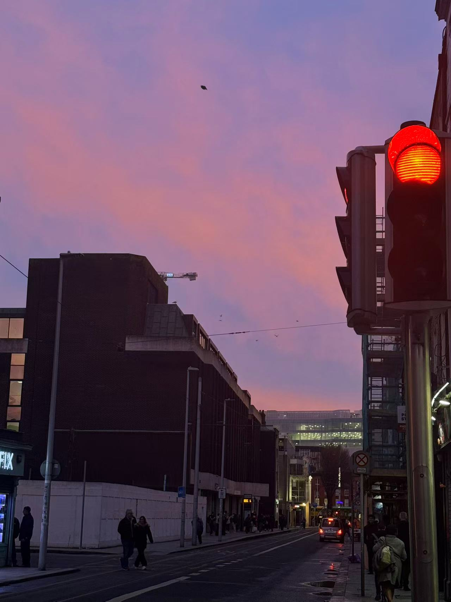
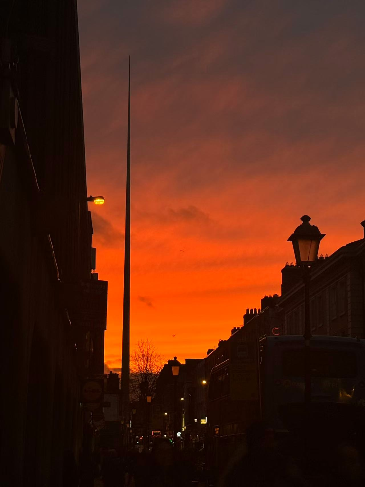
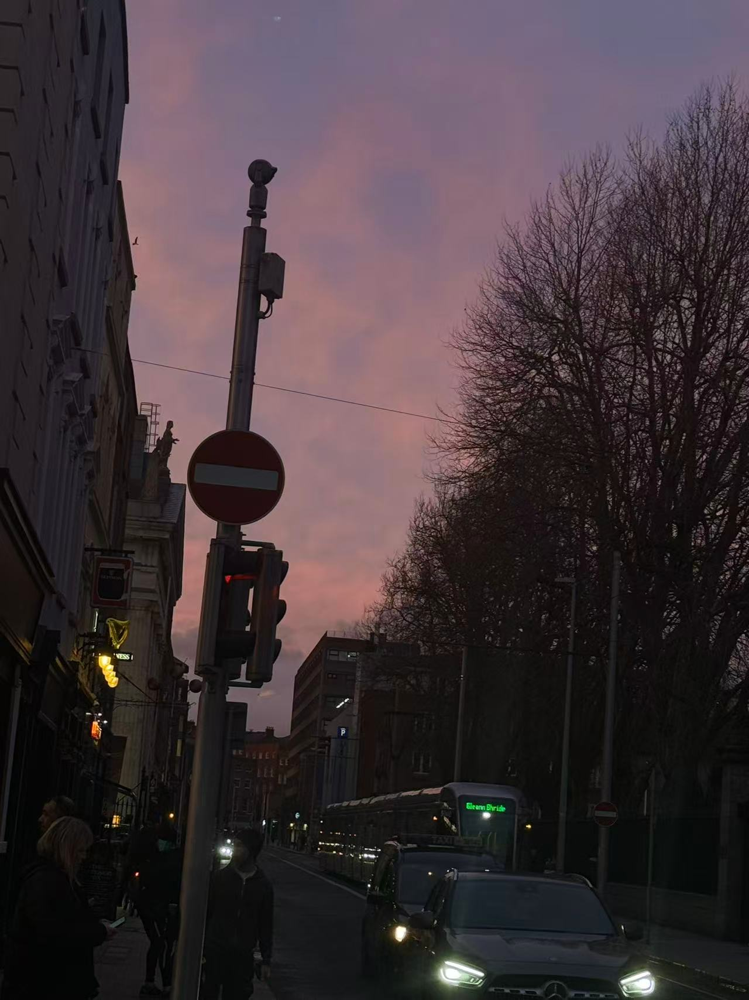
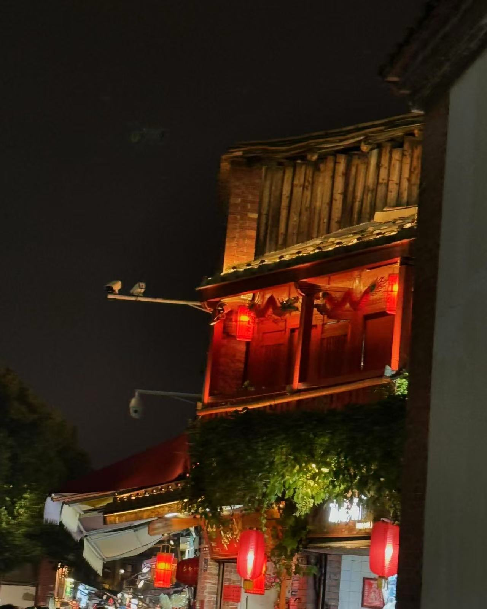

<video class="hero-video-only" autoplay muted loop playsinline>
  <source src="images/scenery-9.mp4" type="video/mp4">
</video>

# Record the Scenery

A visual diary of sunsets, streets, skies, and quiet corners — the small scenes I love to notice and remember.

  
  
  
  
  
  
  
  
  
▶ Video

